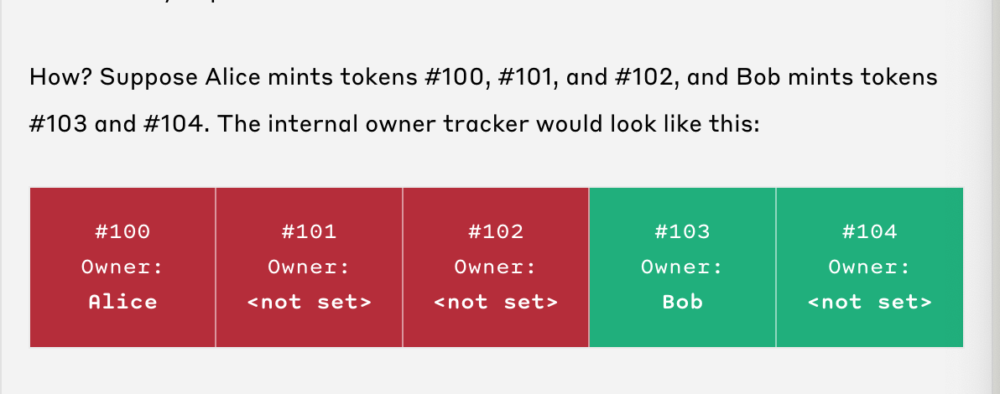

## How does ERC721A save gas?

There are 3 main ways ERC721a optimizes gas over the popular ERC721 base implementation:

1. It removes duplicate storage in the OZ ERC721Enumerable
2. It updates the owner's balance once per batch mint request, instead of per minted NFT
3. It updates the owner data once per batch mint request, instead of per minted NFT
  - only update when owner changes
  

## Where does it add cost?

It adds cost to the next address to trigger a transfer event (usually the minter on opensea). This happens b/c you need to perform 2 actions - the actual mint and also transferring to a next owner.
[erc721a contributor explanation](https://ethereum.stackexchange.com/questions/129857/downsides-of-using-erc721a-over-erc721)
